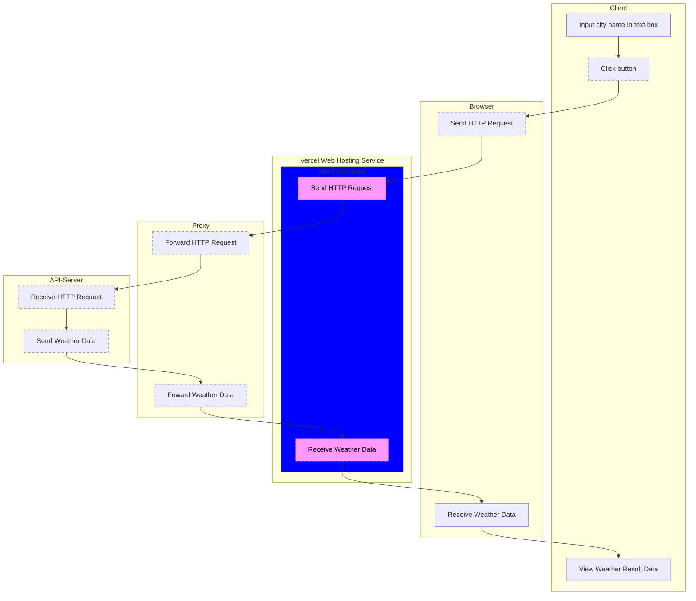

# Weather App using Vue framework
## 概要
[Weather API](https://www.weatherapi.com/) の天気データを取得し表示するWebアプリです。  
api_key/api_secretを秘匿するため、中間にプロキシを経由させています。  
Vue framework を使用しています。

以下の書籍を参考に作成しました。
[「はじめてつくるVueアプリ」](https://monotein.com/books/vue-book)

## 構成図

## 動作
1. Webアプリのテキストボックスへ都市名を入力する
1. [Get Weather]ボタンをクリックする
1. 国名、都市名、気温、天気を表示する
